

    
    

  <h2 style="border-bottom: 1px solid #d8dee4; color: #282d33;"> 🛠️ My Coding Journey </h2>
  

    <table style="width: 100%; border-collapse: collapse;">
      <thead>
        <tr style="background-color: #f4f4f4;">
          <th style="padding: 10px; text-align: left; border: 1px solid #ddd;">Year</th>
          <th style="padding: 10px; text-align: left; border: 1px solid #ddd;">Details</th>
          <th style="padding: 10px; text-align: left; border: 1px solid #ddd;">Studies</th>
           <th style="padding: 10px; text-align: left; border: 1px solid #ddd;">Projects</th>
        </tr>
      </thead>
        <tbody>
         <tr>
           <th style="padding: 10px; text-align: left; border: 1px solid #ddd;">2019</th>
          <td style="padding: 10px; text-align: center; border: 1px solid #ddd;">처음 C언어로 프로그래밍을 시작</td>
          <td style="padding: 10px; text-align: center; border: 1px solid #ddd;">C언어 기본 문법 학습 [교재: 누구나 쉽게 즐기는 C언어 콘서트(누구나 쉽게 즐기는) 천인국]
            </td>
        </tr>
        <tr>
           <th style="padding: 10px; text-align: left; border: 1px solid #ddd;">2021</th>
          <td style="padding: 10px; text-align: center; border: 1px solid #ddd;">Python 중심으로 객체지향 프로그래밍 학습</td>
            <td style="padding: 10px; text-align: center; border: 1px solid #ddd;">객체지향 개념 (클래스, 객체, 상속, 다형성 등) 학습 [교재: 파이썬 Express (천인국 지음, 생능출판)]
            </td>
             <td style="padding: 10px; text-align: center; border: 1px solid #ddd;">-PC 카메라 영상의 배경을 임의의 다른 배경으로 교체 -Implementing one of face recognition algorithms</td>
        </tr>
        <tr>
           <th style="padding: 10px; text-align: left; border: 1px solid #ddd;">2023 (1)</th>
          <td style="padding: 10px; text-align: center; border: 1px solid #ddd;">Android Studio를 이용한 모바일 앱 개발 경험 AI 개론 공부</td>
             <td style="padding: 10px; text-align: center; border: 1px solid #ddd;">안드로이드 앱 개발 (Java) Convolutional Neural Networks (CNN) [교재: 그림으로 쉽게 설명하는 안드로이드 프로그래밍(개정6판), 기계 학습 / 오일석 / 한빛아카데미]
                <td style="padding: 10px; text-align: center; border: 1px solid #ddd;">-전통시장 홍보 및 이용자 증가 위한 시스템 구현- 전통시장 지도 앱</td>
                 

</td>
        </tr>
        <tr>
          <th style="padding: 10px; text-align: left; border: 1px solid #ddd;">2023 (2)</th>
          <td style="padding: 10px; text-align: center; border: 1px solid #ddd;">영상정보처리</td>
            <td style="padding: 10px; text-align: center; border: 1px solid #ddd;">영상 처리 알고리즘 [교재: OpenCV-Python으로 배우는 영상 처리 및 응용]</td>
        </tr>
        <tr>
          <th style="padding: 10px; text-align: left; border: 1px solid #ddd;">2024</th>
          <td style="padding: 10px; text-align: center; border: 1px solid #ddd;">[K-Digital 부산대 24-7회차] AI 활용 빅데이터분석 풀스택웹서비스 SW 개발자 양성과정</td>
        <td style="padding: 10px; text-align: center; border: 1px solid #ddd;">프론트엔드(HTML, Tailwind CSS, React) 백엔드(JSP, Spring Boot, Java) 데이터분석(Python 데이터 처리분석 ,DB SQL, 머신러닝, 텐서플로)</td>
         <td style="padding: 10px; text-align: center; border: 1px solid #ddd;">-요양병원 정보안내 웹서비스 -차량객체 추출 기반 차량번호판 추출 및 예측 서비스</td>
        </tr>
        <tr>
          <th style="padding: 10px; text-align: left; border: 1px solid #ddd;">2025</th>
          <td style="padding: 10px; text-align: center; border: 1px solid #ddd;">2025년 부경대 윈도우 플랫폼기반 IoT 시스템 개발자 과정</td>
           <td style="padding: 10px; text-align: center; border: 1px solid #ddd;">GUI(tkinter), 언어(C, C++,C#) </td>
         <td style="padding: 10px; text-align: center; border: 1px solid #ddd;">-Unreal Engine과 C++로 FPS 게임 프로젝트 -WinApp 미니 프로젝트 -Wpf미니 프로젝트</td>
        </tr>
      </tbody>
    </table>
  

  <h2 style="border-bottom: 1px solid #d8dee4; color: #282d33;"> 🛠️ My Coding Projects </h2>
     

    <table style="width: 100%; border-collapse: collapse;">
      <thead>
        <tr style="background-color: #f4f4f4;">
          <th style="padding: 10px; text-align: left; border: 1px solid #ddd;">프로젝트명</th>
          <th style="padding: 10px; text-align: left; border: 1px solid #ddd;">동기 및 목적</th>
           <th style="padding: 10px; text-align: left; border: 1px solid #ddd;">수행 방향 및 방법</th>
          <th style="padding: 10px; text-align: left; border: 1px solid #ddd;">시연</th>
        </tr>
      </thead>
        <tbody>
         <tr>
           <th style="padding: 10px; text-align: left; border: 1px solid #ddd;">전통시장 홍보 및 이용자 증가 위한 시스템 구현- 전통시장 지도 앱</th>
          <td style="padding: 10px; text-align: center; border: 1px solid #ddd;"> 1.전통시장의 낮은 인지도와 제한적인 연령층 이용 문제를 해결하기 위해 지도 기반의 안내 시스템 필요성 제기  2.
            기존 플랫폼(배달의민족, 네이버/구글 지도) 분석을 통해 정보 부족 및 거리뷰 미지원 지역 등 문제점을 도출  3.
            숨겨진 가게와 리뉴얼 대상 정보를 수집해 지도에 구역별로 시각화, 첫 방문자도 쉽게 이용 가능한 안내 서비스 구현.</td>
          <td style="padding: 10px; text-align: center; border: 1px solid #ddd;">화면 구성(XML)은 프래그먼트, 리스트뷰 등을 사용해서 만들었고,  
        기능(Java)은 구글지도 API, 마커, 인텐트, SQLite DB, 파일 저장 등을 이용해 구현
            </td>
              <td style="padding: 10px; text-align: center; border: 1px solid #ddd;">
              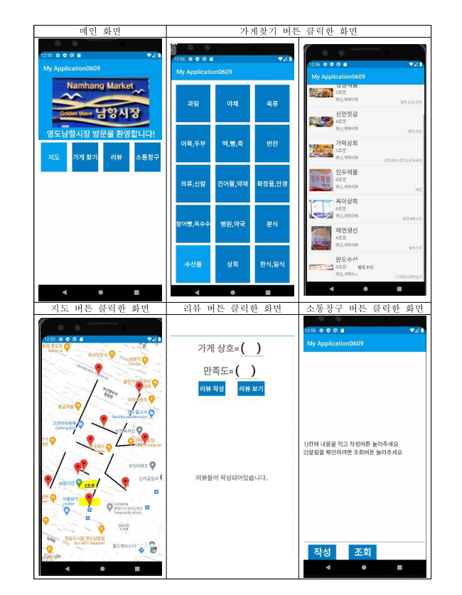  
              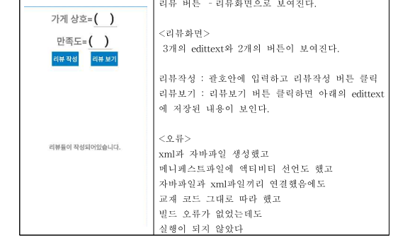  
              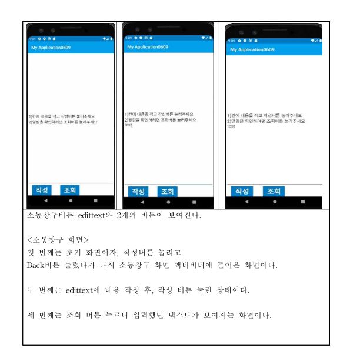
            </td>
        </tr>
        <tr>
           <th style="padding: 10px; text-align: left; border: 1px solid #ddd;">요양병원 정보안내 웹서비스  <a href="https://drive.google.com/file/d/1Wp_CQEwWxYOtuprSBjCQcgX0ubQy1ZNw/view?usp=sharing" target="_blank">
   구현영상
  </a></th>
          <td style="padding: 10px; text-align: center; border: 1px solid #ddd;">요양병원은 일반 병원과 달리 필터 조건으로 찾을 수 있는 사이트가 부족해, 효율적인 검색을 위해 직접 제작하게 되었다.</td>
            <td style="padding: 10px; text-align: center; border: 1px solid #ddd;">1.공공데이터포털의 병원정보 API와 CSV 파일을 활용하여 요양병원 정보를 정제하고, MySQL과 연동해 백엔드 DB를 구축  2. Spring Boot 기반 REST API와 React 프론트를 연동해 병원검색, 로그인/회원가입, 찜하기 등 핵심 기능 구현.
            </td>
         <td style="padding: 10px; text-align: center; border: 1px solid #ddd;">
              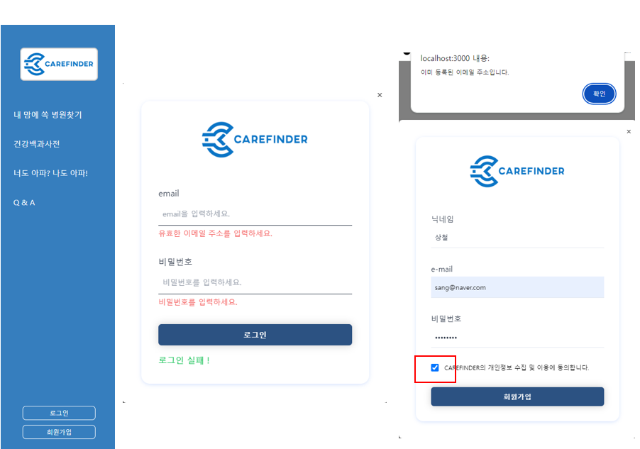  
              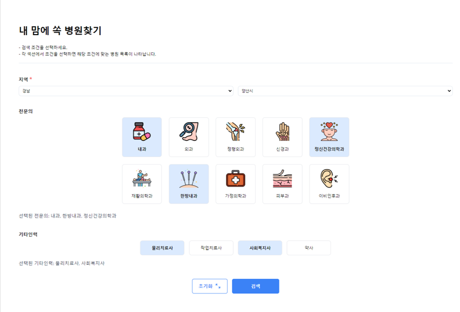  
              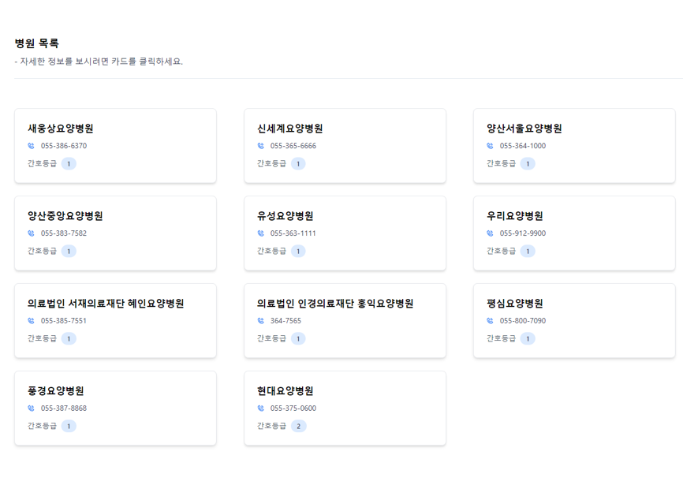
            </td>
        </tr>
             <tr>
           <th style="padding: 10px; text-align: left; border: 1px solid #ddd;">차량객체 추출 기반 차량번호판 추출 및 예측 서비스   <a href="https://drive.google.com/file/d/1KBoFKlI5Y6o9ZepNKIoPyFJoU5tRxlN3/view?usp=sharing" target="_blank">
   구현영상
  </a></th>
          <td style="padding: 10px; text-align: center; border: 1px solid #ddd;">1.차량 번호판 인식  2.번호판 회손 추측  3.다수 차량 인식  4.웹 기반 관리 대시보드</td>
            <td style="padding: 10px; text-align: center; border: 1px solid #ddd;">1. 프로젝트는 이미지 업로드, DB 수정, 차량 번호판 인식 및 처리, 관리자 페이지, 통계 기능을 구현하는 작업으로 구성됨.  2.프론트엔드와 백엔드 간의 이미지 및 데이터 송수신, 웹소켓 통합, JWT 인증 및 권한 관리 등 다양한 기능을 포함.  3.관리자는 회원 승인, 게시판 관리, 통계 조회 및 이미지 처리와 관련된 기능을 수행하며, 전체 시스템의 안정성 향상 및 예외 처리도 중요하게 다룸.
            </td>
         <td style="padding: 10px; text-align: center; border: 1px solid #ddd;">
              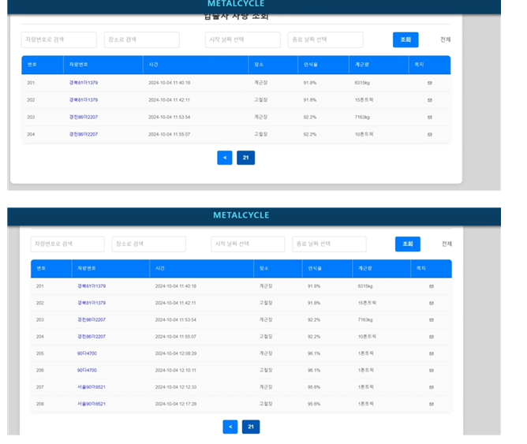  
              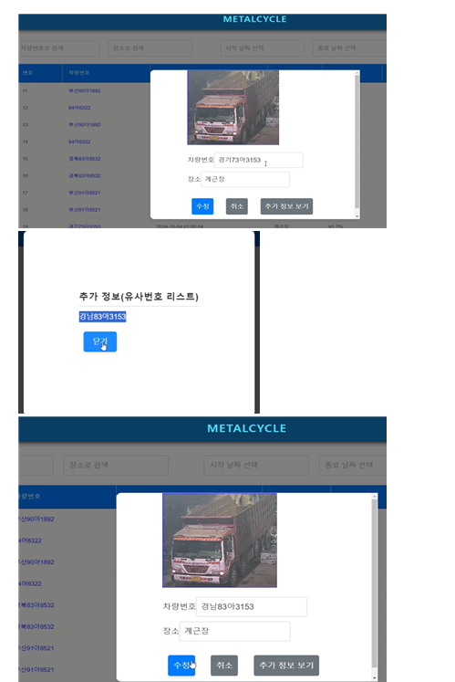  
              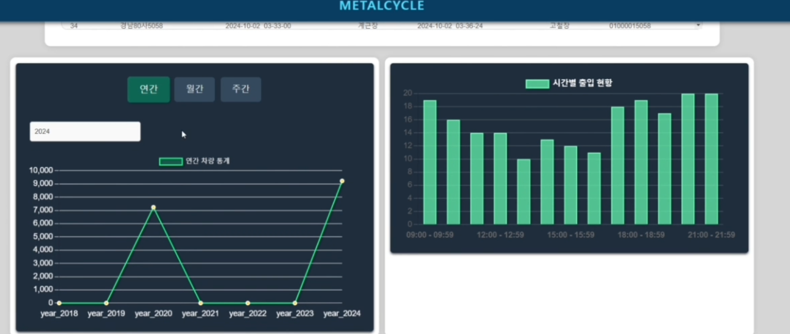
            </td>
             </tr>
           <tr>
           <th style="padding: 10px; text-align: left; border: 1px solid #ddd;">Unreal Engine과 C++로 FPS 게임 프로젝트   <a href="https://drive.google.com/file/d/1eFvqZVRrgGj3uNPfm0lSrtyFuPtQ_tSV/view?usp=sharing"                     target="_blank">
               구현영상
          </a></th>
          <td style="padding: 10px; text-align: center; border: 1px solid #ddd;">역할 기반 팀플레이 중심의 FPS 게임을 통해 언리얼 C++ 실전 개발 역량 강화 및 협동 전술 메커니즘 구현</td>
            <td style="padding: 10px; text-align: center; border: 1px solid #ddd;">1.FPS 캐릭터 기본 기능(이동, 점프, 발사, 조준)과 대시, 방벽, 힐러 스킬 시스템 구현   2.팀 시스템과 캐릭터 별 특성(딜러 대시, 탱커 방벽, 힐러 힐링)까지 연동하여 상호작용 가능하게 구성   3.시각적 피드백(이펙트, 머티리얼 변화), 밸런스 조절(MaxHealth, 데미지), AI 팀 구분까지 테스트   4.AICharacter의 tank,deal,healCharacter에도 기술 적용 및 테스트  <a href="https://drive.google.com/file/d/1Rq3khdSSFgkPmzmGUHBYRDvbML8c0Mn5/view?usp=sharing"                     target="_blank">
               힐러스킬 구현영상
          </a>  <a href="https://drive.google.com/file/d/1G2HuKJOxIjsprWVlX3ixULvo3slZhge5/view?usp=sharing"                     target="_blank">
               탱커 스킬 구현영상
          </a>  <a href="https://drive.google.com/file/d/1i_kXGflDmfnnC9yIJvlDAqKVt5ZkKDOQ/view?usp=sharing"                     target="_blank">
               딜러 스킬 구현영상
          </a>
            </td>
         <td style="padding: 10px; text-align: center; border: 1px solid #ddd;">
           <figure>
              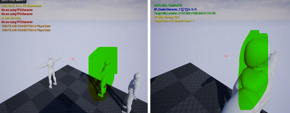
              <figcaption>힐러가 먼 아군에게 보호막 씌우고 데미지 절반 입게 하는 모습</figcaption>
            </figure>
            <figure>
              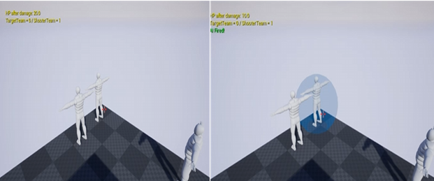
              <figcaption>힐러가 가까운 아군에게 텔레포트해서 힐 주입하는 모습</figcaption>
            </figure>
            <figure>
              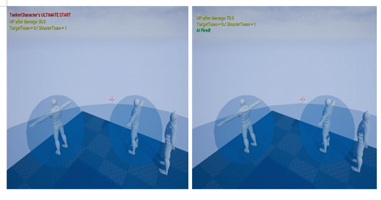
              <figcaption>탱커가 궁극기를 써서 우리팀 모두에게 버블막 씌워서 데미지 절반 입게 하는 모습</figcaption>
            </figure>
        </td>
        </tr>
             <tr>
           <th style="padding: 10px; text-align: left; border: 1px solid #ddd;">윈앱 미니프로젝트 1</th>
          <td style="padding: 10px; text-align: center; border: 1px solid #ddd;">학습용 문제풀이 Windows Forms 애플리케이션  (iot_csharp_winapp_2025/toyProject)</td>
          <td style="padding: 10px; text-align: center; border: 1px solid #ddd;"><a href="iot_csharp_winapp_2025/README.MD">iot_csharp_winapp_2025/README.MD에 기능 및 화면별 설명 있음</a>
                 1. 사용자가 특정 개수의 기출문제를 선택하여 풀고, 해설을 확인하며 학습할 수 있도록 설계된 Windows Forms 기반 퀴즈 학습         프로그램  2.
            각 문제는 4지 선다형 객관식이며, 타이머를 통해 제한 시간 내에 문제를 풀 수 있도록 설계  
            </td>
              <td style="padding: 10px; text-align: center; border: 1px solid #ddd;">
              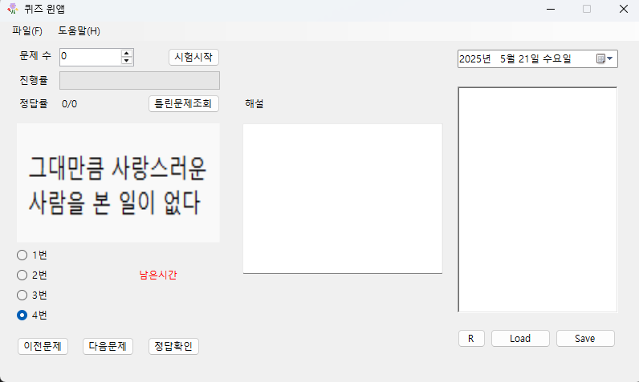
             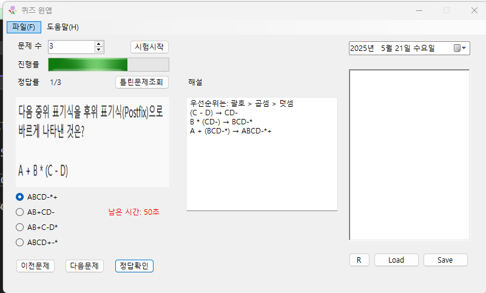
            </td>
        </tr>
      </tbody>
    </table>
  

  
  
    

    <h2 style="border-bottom: 1px solid #d8dee4; color: #282d33;"> 🛠️ Tech Stacks </h2>   
    
   
          
          
          
          
           
          
          
          
          
           
          
          
          
          
           
         
        
          
          
           

    

    
  
 
    

    
 
    <h2 style="border-bottom: 1px solid #d8dee4; color: #282d33;"> 🏅 Stats </h2> 
   
 
    

    
    

 
<!--
**jgtaeeun/jgtaeeun** is a ✨ _special_ ✨ repository because its `README.md` (this file) appears on your GitHub profile.

Here are some ideas to get you started:

- 🔭 I’m currently working on ...
- 🌱 I’m currently learning ...
- 👯 I’m looking to collaborate on ...
- 🤔 I’m looking for help with ...
- 💬 Ask me about ...
- 📫 How to reach me: ...
- 😄 Pronouns: ...
- ⚡ Fun fact: ...
-->
